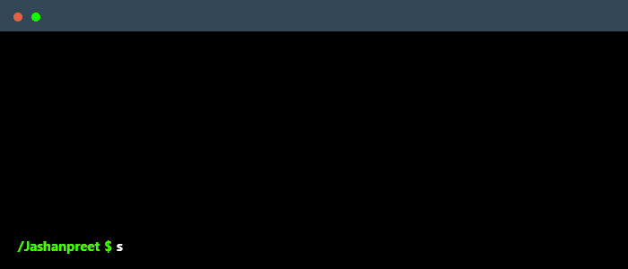

<!--
  Hey, I’m Jashanpreet Singh.
  If you’re reading this, welcome.
-->

<!-- Terminal GIF (optional)
Create one at https://www.terminalgif.com and save it at: ./assets/terminal.gif
-->

  

## Focus
I’m a junior at UT Dallas pursuing a B.S. in Computer Science and actively seeking SWE, cloud engineering, or AI/ML internships.
I build cloud ready systems with strong data foundations, designed for reliability, performance, and scale.
I’m focused on backend services and production systems that are observable and easy to operate, with strong interest in databases and applied AI/ML.
I work well across teams, communicate tradeoffs clearly, and enjoy turning ambiguous problems into simple, shippable solutions.

## Featured repos
- FaultLine: https://github.com/Jashan-tech/FaultLine
- db2rest: https://github.com/9tigerio/db2rest
- ShelfSense: https://github.com/SawyerAlston/ShelfSense

## Main skills

- GCP 
- Docker 
- Linux 
- Bash 
- Python 
- Java 
- TypeScript 
- Node.js 
- PostgreSQL 
- MySQL 
- Spring 
- Vercel 
- OpenCV 
- PyTorch 
- TensorFlow 
- Figma 
- Flask 
- IntelliJ IDEA 
- npm 
- PowerShell 
- Prisma 
- Prometheus 
- Red Hat 
- Supabase 
- Vim 
- Visual Studio 
- Vite 
- VS Code 

## Tools I am learning and exploring

- Kubernetes 
- scikit-learn 

## Connect

  
  

<!-- Optional: GitHub stats

  
  

-->

